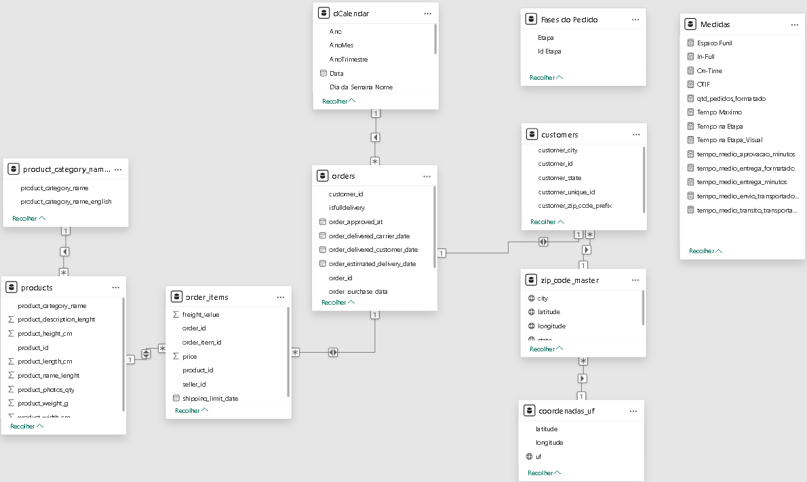

# Visão Geral


Este dashboard foi desenvolvido para monitorar e analisar os indicadores de desempenho logístico, com foco nas métricas de On-Time (Pontualidade), In-Full (Completude) e OTIF (On-Time In-Full), além da Quantidade de Pedidos e o Tempo Médio Gasto em Cada Etapa do processo de entrega. O objetivo é fornecer uma visão clara e objetiva da eficiência logística, permitindo a identificação de gargalos e oportunidades de otimização.

Os dados para este dashboard são provenientes do dataset Brazilian E-commerce ([Kaggle](https://www.kaggle.com/datasets/olistbr/brazilian-ecommerce)), os quais foram persistidos em um banco de dados PostgreSQL. O processo ETL foi realizado diretamente via conector nativo do Power Query, onde as transformações necessárias foram aplicadas antes da modelagem e definição das medidas DAX.

## 1. Arquitetura do Modelo de Dados



**Tabela Fato Central**: `orders` (contendo informações primárias sobre os pedidos).

**Tabelas de Dimensão Ativas no Modelo**:

- `dCalendar` (Dimensão de Tempo)
- `order_items` (Detalhes dos itens do pedido, relacionada à `orders`)
- `customers` (Dimensão de Clientes, utilizada para ligar `orders` a `zip_code_master`)
- `product_category_name` (Dimensão de Categoria de Produto)
- `products` (Dimensão de Produtos)
- `zip_code_master` (Dimensão Geográfica de CEPs, tabela criada e populada no banco de dados PostgreSQL durante a fase de configuração inicial do banco de dados para resolver a ausência de uma chave primária única e a existência de duplicatas na tabela `geolocation` original, permitindo o estabelecimento de relacionamentos eficazes no modelo de dados.)
- `Fases do Pedido` (Dimensão Auxiliar para visualização de etapas)
- `UF` (Dimensão Geográfica de Unidades Federativas, nomeada como `coordenadas_uf` no modelo, tabela criada para otimização e representação geográfica)

<br>

## 2. Processo ETL

As transformações no Power Query são fundamentais para a performance, pois reduzem o volume de dados e preparam as colunas para o modelo DAX.

### 2.1. Tabela: `orders`

Esta é a tabela fato, que contém os dados dos pedidos. As transformações focam em filtrar apenas os dados relevantes para KPIs de entrega e otimizar tipos de dados.

```powerquery
let
    Fonte = PostgreSQL.Database("localhost", "brazilian_ecommerce", [HierarchicalNavigation=true]),
    public = Fonte{[Schema="public"]}[Data],
    orders1 = public{[Name="orders"]}[Data],

    #"Adicionar Coluna Data Compra" = Table.AddColumn(orders1, "order_purchase_data", each DateTime.Date([order_purchase_timestamp]), type date),

    // Filtra linhas para incluir apenas pedidos com status 'delivered' e com todas as datas essenciais preenchidas.
    // Esta é uma optimização crítica, pois reduz significativamente o volume de dados carregados,
    // focando apenas nos pedidos relevantes para as métricas de entrega.
    #"Filtrar Pedidos Entregues e Datas Validas" = Table.SelectRows(#"Adicionar Coluna Data Compra",
        each
            [order_status] = "delivered" and // Apenas pedidos com status 'delivered'
            [order_purchase_timestamp] <> null and [order_purchase_timestamp] <> "" and // Data de compra válida
            [order_delivered_customer_date] <> null and [order_delivered_customer_date] <> "" and // Data de entrega ao cliente válida
            [order_estimated_delivery_date] <> null and [order_estimated_delivery_date] <> "" and // Data estimada de entrega válida
            [order_approved_at] <> null and [order_approved_at] <> "" and // Data de aprovação válida
            [order_delivered_carrier_date] <> null and [order_delivered_carrier_date] <> "" // Data de entrega à transportadora válida
    ),

    // Filtra o range de datas dos pedidos com base na 'order_purchase_timestamp'.
    // Inclui pedidos de 2017 até o final de 2018.
    #"Filtrar Range de Datas" = Table.SelectRows(#"Filtrar Pedidos Entregues e Datas Validas",
        each
            [order_purchase_timestamp] >= #datetime(2017, 1, 1, 0, 0, 0) and // Início do período
            [order_purchase_timestamp] < #datetime(2019, 1, 1, 0, 0, 0) // Fim do período (exclui 2019)
    ),

    // Altera o tipo de dados das colunas de data/hora para 'date' (apenas a parte da data).
    // A granularidade utilizada no projeto foi dd/mm/aaaa
    #"Alterar Tipos de Colunas" = Table.TransformColumnTypes(#"Filtrar Range de Datas",{
        {"order_purchase_timestamp", type date},
        {"order_approved_at", type date},
        {"order_delivered_carrier_date", type date},
        {"order_delivered_customer_date", type date},
        {"order_estimated_delivery_date", type date}
    }),

    #"Colunas Reordenadas Final" = Table.ReorderColumns(#"Alterar Tipos de Colunas",
        {"order_id", "customer_id", "order_status", "order_purchase_timestamp", "order_purchase_data",
         "order_approved_at", "order_delivered_carrier_date", "order_delivered_customer_date",
         "order_estimated_delivery_date", "public.customers", "public.order_items",
         "public.order_payments", "public.order_reviews"}
    )
in
    #"Colunas Reordenadas Final"
```

<br>

### 2.2. Coluna Calculada: `IsFullDelivery` na Tabela `orders`

Esta documentação descreve a criação e o propósito da coluna `IsFullDelivery` na tabela `orders` para o projeto de estudos utilizando o dataset Brazilian E-commerce.

<br>

#### 2.2.1. Conceito de "In-Full"

"In-Full" (Completo) é um KPI logístico que avalia a conformidade da entrega de pedidos. Ele mede a proporção de ordens de venda que, após a entrega ao cliente final, foram recebidas em sua totalidade, sem divergências em relação ao pedido original.

Para ser considerado "In-Full" em operações logísticas reais, um pedido deve cumprir os seguintes critérios:

- **Integridade da Ordem**: Todos os SKUs solicitados devem ter sido entregues, sem faltas ou backorders.
- **Acuracidade de Quantidade**: As quantidades entregues para cada SKU correspondem exatamente às quantidades especificadas na ordem de venda.
- **Qualidade da Entrega**: Os itens foram recebidos em condições adequadas, sem avarias ou danos.
- **Status de Conclusão**: A avaliação é aplicável exclusivamente a pedidos com status de entrega concluído. Pedidos em trânsito, pendentes ou cancelados não são elegíveis para esta métrica.

Este conceito é um dos pilares do OTIF (On-Time In-Full), que busca a perfeição na entrega.

<br>

#### 2.2.2. Limitações do dataset Brazilian E-commerce para o cálculo do "In-Full"

O dataset Brazilian E-commerce apresenta alguns desafios para calcular o "In-Full":

- **Ausência de Detalhe de Quantidade por Item Entregue**: A tabela `order_items` carece de campos explícitos como `quantidade_pedida` e `quantidade_entregue` por SKU, impedindo a validação da acuracidade de quantidade.
- **Status de Entrega Agregado**: O `order_status` é fornecido apenas a nível de `order_id` (pedido), sem granularidade por item individual, impossibilitando a identificação de entregas parciais.
- **Dados de Não Conformidade Indiretos**: A tabela `order_reviews` oferece feedback do cliente (`review_score`), que pode indicar problemas na entrega (ex: item faltante/danificado), mas não fornece um flag direto e objetivo para "entrega incompleta".

Devido a essas limitações, a determinação de `IsFullDelivery` com base em regras de negócio não é diretamente factível com os dados brutos desse dataset.

<br>

#### 2.2.3. Abordagem e Lógica de Criação (Simulação)

Para viabilizar o cálculo de KPIs de entrega neste projeto de estudos, a coluna `IsFullDelivery` foi simulada diretamente no banco de dados. Esta escolha permite a demonstração prática da aplicação de KPIs no Power BI, contornando as restrições do dataset.

**Código SQL para Criação e População**:

```sql
-- 1. Adicionar a nova coluna 'IsFullDelivery' à tabela 'orders'
ALTER TABLE orders
ADD COLUMN IsFullDelivery BOOLEAN;

-- 2. Popular a nova coluna com base na lógica de 85.79% de TRUE para pedidos 'delivered'
-- e NULL para outros status.
UPDATE orders
SET IsFullDelivery =
    CASE
        WHEN order_status = 'delivered' THEN
            CASE
                WHEN RANDOM() < 0.8579 THEN TRUE
                ELSE FALSE
            END
        ELSE NULL
    END;

-- Opcional: Se você quiser adicionar um índice para a nova coluna (útil para grandes tabelas se for usada em WHERE clauses)
-- CREATE INDEX idx_orders_isfull_delivery ON orders (IsFullDelivery);
```

**Análise da Lógica Implementada**:

- **Tratamento de Status**: Pedidos com `order_status` diferente de 'delivered' recebem NULL, alinhado ao conceito de que "In-Full" se aplica apenas a entregas concluídas.
- **Simulação de Conformidade**: Para pedidos 'delivered', um valor booleano (TRUE ou FALSE) é atribuído aleatoriamente, com uma probabilidade de 85.79% de ser TRUE. Este percentual é arbitrário e visa apenas a demonstração.
- **Propósito**: A simulação permite que a métrica "In-Full" seja calculada, validando o comportamento esperado de um KPI de porcentagem em um ambiente de estudo.

<br>

#### 2.2.4. Impacto no Power BI

Ao importar `IsFullDelivery` para o Power BI (contendo TRUE, FALSE e NULL), as medidas DAX foram configuradas para lidar com esses valores.

Embora a coluna `IsFullDelivery` no banco de dados possa conter NULLs para pedidos não entregues, as medidas DAX de In-Full e OTIF já incluem o filtro `NOT ISBLANK('orders'[order_delivered_customer_date])`. Este filtro garante que apenas pedidos com data de entrega registrada sejam considerados nos cálculos, efetivamente tratando os NULLs de `IsFullDelivery` (que ocorrem quando `order_delivered_customer_date` é NULL) como FALSE para o propósito da métrica.

A utilização direta de `orders[IsFullDelivery]` nas medidas DAX, em conjunto com os filtros de data de entrega, assegura cálculos precisos e visuais contínuos, alinhados à definição logística de "In-Full" para pedidos entregues.

<br>

#### 2.2.5. Conclusão da `IsFullDelivery`

A coluna `IsFullDelivery` neste projeto é um substituto funcional e didático para uma métrica de completude de entrega que, de outra forma, seria inviável com as limitações do dataset Brazilian E-commerce. Ela permite a construção e demonstração de KPIs logísticos, respeitando o conceito de "In-Full" e contornando as restrições de granularidade de dados para fins de estudo.

<br>

### 2.3. Tabela: `order_items`

Esta tabela contém os detalhes dos itens de cada pedido.

```powerquery
let
    Fonte = PostgreSQL.Database("localhost", "brazilian_ecommerce", [HierarchicalNavigation=true]),
    public = Fonte{[Schema="public"]}[Data],
    order_items1 = public{[Name="order_items"]}[Data],

    // Altera o tipo de dados da coluna 'shipping_limit_date' para 'date'.
    #"Tipo Alterado" = Table.TransformColumnTypes(order_items1,{{"shipping_limit_date", type date}}),

    // Filtra linhas para incluir apenas itens com 'shipping_limit_date' após 31/12/2016.
    // Alinha o período de dados com a tabela 'orders'.
    #"Linhas Filtradas" = Table.SelectRows(#"Tipo Alterado", each [shipping_limit_date] > #date(2016, 12, 31))
in
    #"Linhas Filtradas"
```

<br>

### 2.4. Tabela: `zip_code_master`

Esta tabela foi criada e populada no banco de dados PostgreSQL durante a fase de configuração inicial do banco de dados. Sua finalidade é resolver a ausência de uma chave primária e a existência de múltiplas entradas duplicadas para o mesmo prefixo de CEP na tabela `geolocation` original. Ao consolidar esses dados em uma granularidade de CEP única, `zip_code_master` otimiza a modelagem de dados, permitindo o estabelecimento de relacionamentos eficazes e servindo como uma dimensão geográfica limpa e eficiente para informações de localização.

```powerquery
let
    Fonte = PostgreSQL.Database("localhost", "brazilian_ecommerce", [HierarchicalNavigation=true]),
    public = Fonte{[Schema="public"]}[Data],
    zip_code_master1 = public{[Name="zip_code_master"]}[Data],

    // Filtra linhas para incluir apenas latitudes e longitudes dentro do range geográfico específico do Brasil.
    // Otimiza o volume de dados geográficos.
    #"Linhas Filtradas" = Table.SelectRows(zip_code_master1, each [latitude] <= 5.27438888 and [latitude] >= -33.75116944),
    #"Linhas Filtradas1" = Table.SelectRows(#"Linhas Filtradas", each [longitude] >= -73.98283055 and [longitude] <= -34.79314722),
    #"Tipo Alterado" = Table.TransformColumnTypes(#"Linhas Filtradas1",{{"latitude", type text}, {"longitude", type text}})
in
    #"Tipo Alterado"
```

<br>

### 2.5. Tabela: `UF` (`coordenadas_uf`)

Esta tabela de dimensão foi criada manualmente (enriquecimento) para fornecer informações geográficas em nível de Unidade Federativa. Ela contém as UFs e suas coordenadas representativas, otimizando a representação e análise espacial no dashboard.

```powerquery
let
    Fonte = Fonte = Table.FromRows(Json.Document(Binary.Decompress(Binary.FromText("TZJJbsMwDEXv4nX7oYHUgK6c1A1a1I1hZ5fk/teIQ5FKdwKfPodPXq/DePy4De8FOd+G5ys7MN+G4f62s99npCKFxmJCCcZmiYBUlxjeGVv2iAf5hthLdkGH8RnxEaE2SDv0Co+TfEdwWq+Co7LPLxEySlRhRkkKp01ghbesDpEUns6qrEVhfSnnsZUkHZH2pwnniwgDEukg7V+DUjLsbtmUBO7KkyiLWCJpCbEoXMbmXNZeOYA6O8gOEEp3PFvFZZWKhFK7r31Vy9TWGE34z3nJWxaEZM0EyS9s/ZGke4Q7TCZc/5o5xfduuBprrrq+jxRflq9iTnTweh0cwXYd6yrXUXWK5BFtyZscY8gg7YYdqo24TVqRc5+ROlx0jn4BRQwWeDm3O6bUWZAZ7w8=", BinaryEncoding.Base64), Compression.Deflate)), let _t = ((type nullable text) meta [Serialized.Text = true]) in type table [#"uf;""latitude"";""longitude""" = _t]),

    // Altera o tipo da coluna inicial para texto.
    #"Tipo Alterado" = Table.TransformColumnTypes(Fonte,{{"uf;""latitude"";""longitude""", type text}}),

    // Divide a coluna única em três colunas separadas usando o delimitador ';'.
    #"Dividir Coluna por Delimitador" = Table.SplitColumn(#"Tipo Alterado", "uf;""latitude"";""longitude""", Splitter.SplitTextByDelimiter(";", QuoteStyle.Csv), {"uf;""latitude"";""longitude"".1", "uf;""latitude"";""longitude"".2", "uf;""latitude"";""longitude"".3"}),

    // Renomeia as colunas divididas para 'uf', 'latitude' e 'longitude'.
    #"Colunas Renomeadas" = Table.RenameColumns(#"Dividir Coluna por Delimitador",{{"uf;""latitude"";""longitude"".1", "uf"}, {"uf;""latitude"";""longitude"".2", "latitude"}, {"uf;""latitude"";""longitude"".3", "longitude"}})
in
    #"Colunas Renomeadas"
```

<br>

### 2.6. Tabela: `dCalendar`

Esta é a tabela de dimensão de tempo, criada via DAX.

```dax
dCalendar =
VAR MinPurchaseDate = MIN(orders[order_purchase_data])
VAR MaxPurchaseDate = MAX(orders[order_purchase_data])

VAR MinDeliveryDate = MIN(orders[order_delivered_customer_date])
VAR MaxDeliveryDate = MAX(orders[order_delivered_customer_date])

VAR MinEstimatedDeliveryDate = MIN(orders[order_estimated_delivery_date])
VAR MaxEstimatedDeliveryDate = MAX(orders[order_estimated_delivery_date])

// Determina a data mínima e máxima abrangendo todas as datas relevantes dos pedidos.
VAR FinalMinDate = MIN(MinPurchaseDate, MIN(MinDeliveryDate, MinEstimatedDeliveryDate))
VAR FinalMaxDate = MAX(MaxPurchaseDate, MAX(MaxDeliveryDate, MaxEstimatedDeliveryDate))

// Cria a base do calendário com uma coluna 'Data'.
VAR BaseCalendar =
    SELECTCOLUMNS(
        CALENDAR(
            FinalMinDate,
            FinalMaxDate
        ),
        "Data", [Date]
    )
RETURN
// Adiciona colunas de tempo (Ano, Mês, Trimestre, etc.) para análise temporal.
ADDCOLUMNS(
    BaseCalendar,
    "Ano", YEAR([Data]),
    "Trimestre", "Q" & QUARTER([Data]),
    "Numero do Mês", MONTH([Data]),
    "Nome do Mês", FORMAT([Data], "MMM", "pt-BR"), // Nome abreviado do mês
    "Numero da Semana", WEEKNUM([Data], 2), // Semana do ano, começando segunda-feira
    "Dia da Semana Numero", WEEKDAY([Data], 2), // Dia da semana (1=Segunda, 7=Domingo)
    "Dia da Semana Nome", FORMAT([Data], "dddd", "pt-BR"), // Nome completo do dia da semana
    "Semana do Mês", // Calcula a semana do mês
        WEEKNUM([Data], 2)
        - WEEKNUM(DATE(YEAR([Data]), MONTH([Data]), 1), 2) + 1,
    "AnoMes", FORMAT([Data], "YYYY-MM"), // Formato para ordenação cronológica de Ano/Mês
    "AnoTrimestre", FORMAT([Data], "YYYY") & " Q" & QUARTER([Data]) // Formato para Ano/Trimestre
)
```

<br>

### 2.7. Tabela: `Fases do Pedido`

Esta é uma tabela de dimensão criada diretamente no Power BI utilizando DAX (`DATATABLE`). Seu propósito principal é categorizar as diferentes etapas do processo de entrega em uma sequência lógica (`Id Etapa`), permitindo a visualização do tempo médio gasto em cada fase através de gráficos de funil ou waterfall. Ela serve como uma dimensão auxiliar para análise de fluxo e gargalos no processo logístico.

```dax
Fases do Pedido =
DATATABLE (
    "Id Etapa", INTEGER,
    "Etapa", STRING,
    {
        { 1, "Aprovação Pedido" },
        { 2, "Envio Transportadora" },
        { 3, "Trânsito Transportadora" },
        { 4, "Total Entrega" }
    }
)
```

<br>

## 3. Definição e Cálculo das Medidas DAX Principais

As medidas DAX utilizadas no dashboard calculam KPIs essenciais para monitorar a performance logística, como `On-Time`, `In-Full`, `OTIF`, quantidade de pedidos e tempos médios por etapa do processo de entrega, apresentados em gráficos e tabelas.

### 3.1. qtd_pedidos_formatado

Calcula o número distinto de pedidos e formata dinamicamente para exibição em milhares (ex.: "10.5k") ou como número inteiro, usado no gráfico "Total de Pedidos ao Longo do Tempo" e na tabela.

```dax
qtd_pedidos_formatado = DISTINCTCOUNT('order_items'[order_id])
```

Formatação dinâmica para exibição (em milhares ou número inteiro)
```dax
VAR totalAjustado = 
    SWITCH(
        TRUE(),
        totalPedidos >= 1000, FORMAT(totalPedidos, "0,.0k"),
        FORMAT(totalPedidos, "#")
    )
RETURN totalAjustado
```

**Justificativa**: Fornece uma contagem de pedidos formatada de forma amigável para visualizações, facilitando a leitura de grandes volumes de dados.

<br>

### 3.2. On-Time

Calcula a porcentagem de pedidos entregues no prazo, com base na data de compra.

```dax
On-Time = 
VAR PedidosEntreguesNoPrazoNoPeriodo =
    CALCULATE(
        [qtd_pedidos_formatado], 
        REMOVEFILTERS('orders'[order_delivered_customer_date]), 
        'orders'[order_delivered_customer_date] <= 'orders'[order_estimated_delivery_date]
    )
VAR TotalPedidosCompradosEntreguesNoPeriodo =
    CALCULATE(
        [qtd_pedidos_formatado], 
        REMOVEFILTERS('orders'[order_delivered_customer_date])
    )
RETURN
IF(
    ISBLANK(PedidosEntreguesNoPrazoNoPeriodo), 
    0,
    DIVIDE(
        PedidosEntreguesNoPrazoNoPeriodo,
        TotalPedidosCompradosEntreguesNoPeriodo,
        0
    )
)
```

**Justificativa**: Essencial para avaliar a pontualidade das entregas, considerando apenas pedidos com datas de entrega válidas e comparando com a data estimada.

<br>

### 3.3. In-Full

Calcula a porcentagem de pedidos entregues de forma completa, com base na data de compra.

```dax
In-Full = 
VAR PedidosEntreguesCompletosNoPeriodo =
    CALCULATE(
        [qtd_pedidos_formatado], 
        REMOVEFILTERS('orders'[order_delivered_customer_date]), 
        'orders'[IsFullDelivery] = TRUE()
    )
VAR TotalPedidosCompradosEntreguesNoPeriodo =
    CALCULATE(
        [qtd_pedidos_formatado], 
        REMOVEFILTERS('orders'[order_delivered_customer_date])
    )
RETURN
IF(
    ISBLANK(PedidosEntreguesCompletosNoPeriodo), 
    0,
    DIVIDE(
        PedidosEntreguesCompletosNoPeriodo,
        TotalPedidosCompradosEntreguesNoPeriodo,
        0
    )
)
```

**Justificativa**: Avalia a completude das entregas, utilizando a coluna simulada `IsFullDelivery` (Seção 3.2). O `REMOVEFILTERS` assegura a análise correta do período de compra.

<br>

### 3.4. OTIF

Calcula a porcentagem de pedidos que são *On-Time* e *In-Full*, com base na data de compra.

```dax
OTIF = [On-Time] * [In-Full]
```

**Justificativa**: Combina as condições de `On-Time` e `In-Full` para fornecer uma métrica abrangente da perfeição na entrega, refletindo a eficiência logística total.

<br>

### 3.5. tempo_medio_aprovacao_minutos

Calcula o tempo médio em minutos entre a data de compra e a aprovação do pedido.

```dax
tempo_medio_aprovacao_minutos = 
VAR MediaMinutos =
    AVERAGEX(
        FILTER(
            'orders',
            NOT ISBLANK('orders'[order_approved_at])
        ),
        DATEDIFF(
            'orders'[order_purchase_timestamp],
            'orders'[order_approved_at],
            MINUTE
        )
    )
RETURN MediaMinutos
```

**Justificativa**: Fornece a duração média da fase de aprovação do pedido, um KPI crítico para avaliar a eficiência do processamento inicial.

<br>

### 3.6. tempo_medio_envio_transportadora_minutos

Calcula o tempo médio em minutos entre a aprovação do pedido e a entrega à transportadora.

```dax
tempo_medio_envio_transportadora_minutos = 
VAR MediaMinutos =
    AVERAGEX(
        FILTER(
            'orders',
            NOT ISBLANK('orders'[order_approved_at]) && NOT ISBLANK('orders'[order_delivered_carrier_date])
        ),
        DATEDIFF(
            'orders'[order_approved_at],
            'orders'[order_delivered_carrier_date],
            MINUTE
        )
    )
RETURN MediaMinutos
```

**Justificativa**: Fornece a duração média da fase de envio à transportadora, um KPI importante para o monitoramento da agilidade na expedição.

<br>

### 3.7. tempo_medio_transito_transportadora_minutos

Calcula o tempo médio em minutos entre a entrega à transportadora e a entrega ao cliente final.

```dax
tempo_medio_transito_transportadora_minutos = 
VAR MediaMinutos =
    AVERAGEX(
        FILTER(
            'orders',
            NOT ISBLANK('orders'[order_delivered_carrier_date]) && NOT ISBLANK('orders'[order_delivered_customer_date])
        ),
        DATEDIFF(
            'orders'[order_delivered_carrier_date],
            'orders'[order_delivered_customer_date],
            MINUTE
        )
    )
RETURN MediaMinutos
```

**Justificativa**: Fornece a duração média da fase de trânsito pela transportadora, um KPI importante para avaliar o desempenho da transportadora.

<br>

### 3.8. tempo_medio_entrega_formatado

Calcula o tempo médio total de entrega e apresenta em um formato legível (dias, horas, minutos). Usado como rótulo de dados no gráfico "Tempo Médio Gasto em cada Etapa" e em tabelas.

```dax
tempo_medio_entrega_formatado = 
VAR MediaMinutos =
    AVERAGEX(
        FILTER(
            'orders',
            NOT ISBLANK('orders'[order_delivered_customer_date]) && 
            NOT ISBLANK('orders'[order_purchase_timestamp])
        ),
        DATEDIFF(
            'orders'[order_purchase_timestamp], 
            'orders'[order_delivered_customer_date], 
            MINUTE
        )
    )
VAR TotalHoras = MediaMinutos / 60
VAR Dias = INT(TotalHoras / 24)
VAR HorasRestantes = MOD(INT(TotalHoras), 24)
VAR MinutosRestantes = MOD(MediaMinutos, 60)
RETURN
IF(
    ISBLANK(MediaMinutos),
    "",
    SWITCH(
        TRUE(),
        TotalHoras < 24,
            FORMAT(INT(TotalHoras), "00") & ":" & FORMAT(MinutosRestantes, "00"),
        Dias & "d" &
        IF(
            HorasRestantes > 0,
            " " & FORMAT(HorasRestantes, "00") & "h",
            ""
        ) &
        IF(
            MinutosRestantes > 0 && Dias > 0, 
            " " & FORMAT(MinutosRestantes, "00") & "m",
            ""
        )
    )
)
```

**Justificativa**: Permite a visualização rápida e compreensível do tempo total gasto no processo logístico diretamente nos rótulos de dados do gráfico e em tabelas.

<br>

### 3.9. Tempo na Etapa

Utiliza uma estrutura SWITCH para selecionar a medida de tempo médio correspondente à fase do pedido.

```dax
Tempo na Etapa = 
SWITCH(
    SELECTEDVALUE('Fases do Pedido'[Etapa]),
    "Aprovação Pedido", [tempo_medio_aprovacao_minutos],
    "Envio Transportadora", [tempo_medio_envio_transportadora_minutos],
    "Trânsito Transportadora", [tempo_medio_transito_transportadora_minutos],
    "Total Entrega", [tempo_medio_entrega_minutos],
    BLANK()
)
```

**Justificativa**: Agrega dinamicamente o tempo médio de cada fase do pedido, servindo como base para cálculos visuais no gráfico de funil.

<br>

### 3.10. Tempo na Etapa_Visual

Ajusta o valor de `Tempo na Etapa` para visualização no gráfico de funil, garantindo que etapas com durações curtas sejam visíveis.

```dax
Tempo na Etapa_Visual = 
VAR ValorOriginalEmMinutos = [Tempo na Etapa]
VAR ValorMinimoParaExibicao = 2500
RETURN
IF(
    ValorOriginalEmMinutos < ValorMinimoParaExibicao,
    ValorMinimoParaExibicao,
    ValorOriginalEmMinutos
)
```

**Justificativa**: Introduz um "piso" de 2500 minutos para etapas com menor tempo, garantindo visibilidade do rótulo de dados.

<br>

### 3.11. Tempo Maximo

Determina o valor máximo de `[Tempo na Etapa]` entre todas as fases do pedido selecionadas ou existentes.

```dax
Tempo Maximo = 
MAXX(
    ALLSELECTED('Fases do Pedido'),
    [Tempo na Etapa]
)
```

**Justificativa**: Utilizado como referência para o cálculo do Espaco Funil, garantindo a correta proporção visual no gráfico de funil.

<br>

### 3.12. Espaco Funil

Calcula o espaço auxiliar necessário para criar a forma visual do funil em gráficos específicos, garantindo a correta proporção entre as etapas.

```dax
Espaco Funil = 
( [Tempo Maximo] - [Tempo na Etapa_Visual] ) / 2
```

**Justificativa**: Garante que as "barras" do funil se estreitem corretamente, calculando o preenchimento necessário para a representação simétrica..

<br>

### 3.13. tempo_medio_entrega_minutos

Calcula o tempo médio total de entrega em minutos entre a data de compra e a entrega ao cliente.

```dax
tempo_medio_entrega_minutos = 
VAR MediaMinutos =
    AVERAGEX(
        FILTER(
            'orders',
            NOT ISBLANK('orders'[order_delivered_customer_date]) && 
            NOT ISBLANK('orders'[order_purchase_timestamp])
        ),
        DATEDIFF(
            'orders'[order_purchase_timestamp], 
            'orders'[order_delivered_customer_date], 
            MINUTE
        )
    )
RETURN MediaMinutos
```

**Justificativa**: Fornece o tempo médio bruto em minutos do processo logístico total, servindo como base para cálculos como `Tempo na Etapa` e `tempo_medio_entrega_formatado`.
